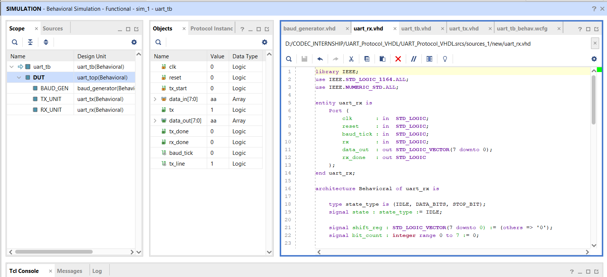
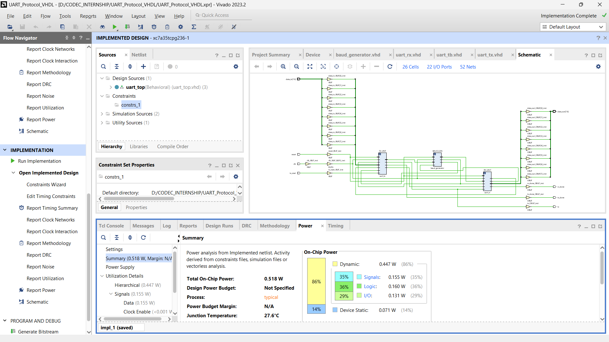

# UART Communication Protocol in VHDL

FPGA-Based UART (Universal Asynchronous Receiver Transmitter) Communication Protocol designed using **VHDL** and implemented in **Xilinx Vivado 2023.2** on an **Artix-7 FPGA**. This project demonstrates asynchronous serial communication by transmitting and receiving 8-bit data using dedicated UART Transmitter and Receiver modules synchronized through a Baud Rate Generator.

---

## Project Overview

UART is one of the most widely used serial communication protocols in embedded systems. This project implements a complete UART communication system capable of transmitting parallel data serially and reconstructing the original data at the receiver.

The design is completely modular and consists of separate transmitter, receiver, baud generator, and top-level integration modules.

---

## Features

- UART Transmitter (TX)
- UART Receiver (RX)
- Baud Rate Generator
- Modular VHDL Design
- RTL Schematic
- Functional Simulation
- Synthesized Design
- Implemented Design
- Project Hierarchy
- System Block Diagram

---

## Development Environment

| Tool | Version |
|------|---------|
| Xilinx Vivado | 2023.2 |
| Language | VHDL |
| FPGA Family | Artix-7 |
| Device | xc7a35tcpg236-1 |

---

# Project Architecture

## System Block Diagram


---

## RTL Schematic


---

## Functional Simulation

The simulation verifies successful UART data transmission and reception.

**Input Data :**

```
0xAA
```

**Received Data :**

```
0xAA
```


---

## Project Hierarchy



---

## Implemented Design



---

# Project Structure

```
UART-Protocol-VHDL
│
├── baud_generator.vhd
├── uart_tx.vhd
├── uart_rx.vhd
├── uart_top.vhd
├── uart_tb.vhd
│
├── UART_Block_Diagram.png
├── UART_Project_Hierarchy.png
├── UART_RTL_Schematic.png
├── UART_Simulation_Waveform.png
├── UART_Implemented_Design.png
│
├── LICENSE
└── README.md
```

---

# Working Principle

1. Parallel input data is applied to the UART Transmitter.
2. The Baud Generator generates the baud tick required for serial communication.
3. The Transmitter converts parallel data into serial bits.
4. Serial data is transferred through the TX line.
5. The UART Receiver receives the serial bits.
6. The received serial data is converted back into parallel data.
7. The received data is available at the output with the receive completion signal.

---

# Simulation Results

The simulation confirms:

- Successful UART data transmission
- Successful UART data reception
- Correct reconstruction of transmitted data
- Proper operation of UART Receiver
- Correct timing using Baud Generator

---

# Applications

- FPGA-Based Embedded Systems
- UART Communication Interfaces
- Microcontroller Communication
- Industrial Automation
- IoT Devices
- Robotics
- Digital Communication Systems
- Educational FPGA Projects

---

# Future Enhancements

- Configurable Baud Rate
- Parity Bit Support
- Multiple Stop Bits
- FIFO Buffer
- Interrupt Support
- Hardware Testing on Physical FPGA Board

---

# Repository Contents

- Complete VHDL Source Code
- Testbench
- RTL Schematic
- Functional Simulation
- Implemented Design
- Project Hierarchy
- Block Diagram
- Documentation

---

# Author

**Sanika Shriram Patil**

Electronics and Computer Engineering

Maharashtra Institute of Technology, Chhatrapati Sambhajinagar

---

# License

This project is licensed under the **MIT License**.

---

## If you found this project helpful, consider giving it a ⭐ on GitHub.
