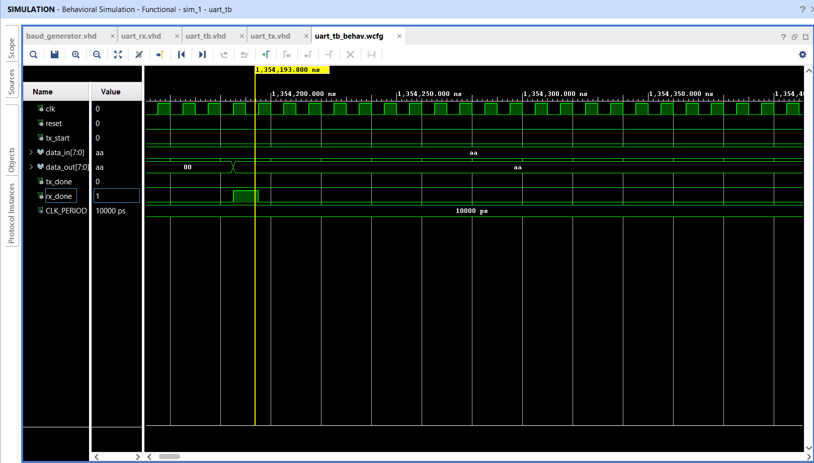

# UART Communication Protocol in VHDL

A UART (Universal Asynchronous Receiver Transmitter) communication system designed using **VHDL** and implemented in **Vivado 2023.2** for the **Artix-7 FPGA**. This project demonstrates complete UART data transmission and reception with a dedicated baud rate generator and verifies successful communication through behavioral simulation.

---

# Project Features

- UART Transmitter (TX)
- UART Receiver (RX)
- Baud Rate Generator
- UART Top Module
- Behavioral Testbench
- Functional Simulation
- RTL Schematic
- Implemented Design
- Project Hierarchy

---

# Development Environment

| Tool | Version |
|------|----------|
| Vivado | 2023.2 |
| Language | VHDL |
| FPGA Family | Artix-7 |
| Device | XC7A35T |

---

# Project Structure

```
UART-Protocol-VHDL
│
├── baud_generator.vhd
├── uart_tx.vhd
├── uart_rx.vhd
├── uart_top.vhd
├── uart_tb.vhd
│
├── UART_PROJECT_BLOCK_DIAGRAM.jpg
├── UART_RTL_Schematic.png
├── Simulation_Waveform.png
├── UART_Project_Hierarchy.png
├── UART_Implemented_Design.png
│
└── README.md
```

---

# System Block Diagram


---

# RTL Schematic


---

# Functional Simulation

The UART transmitter successfully sends **0xAA**, and the receiver correctly reconstructs the same data.

**Input Data**

```
0xAA
```

**Received Data**

```
0xAA
```



---

# Project Hierarchy


---

# Implemented Design


---

# Working Principle

1. The Baud Generator generates the baud tick.
2. UART Transmitter serializes the 8-bit parallel input data.
3. Serial data is transmitted through the TX line.
4. UART Receiver samples incoming serial bits.
5. Received serial data is converted back into parallel form.
6. The receiver asserts `rx_done` after successful reception.

---

# Simulation Result

| Parameter | Value |
|-----------|-------|
| Input Data | 0xAA |
| Received Data | 0xAA |
| Transmission | Successful |
| Reception | Successful |
| Verification | Passed |

---

# Applications

- FPGA-Based Embedded Systems
- Serial Communication
- Microcontroller Interfaces
- Industrial Automation
- IoT Devices
- Digital Communication Systems

---

# Future Improvements

- Configurable Baud Rate
- Parity Bit Support
- Multiple Stop Bits
- FIFO Buffer
- Interrupt Support
- FPGA Hardware Validation

---

# Author

**Sanika Shriram Patil**

Electronics and Computer Engineering

---

# License

This project is licensed under the MIT License.
